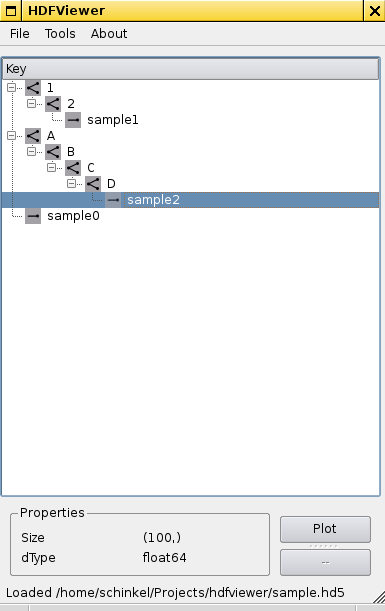

README
======

Requirements:
-------------

  * PySide
  * numpy
  * h5py
  * matplotlib (for plotting)

Prequesites for h5py:
---------------------
In order to ```pip-2.7 install h5py``` a number of dependencies had to be satisfied. On my openSuse 13.1 box those where:
```sh
sudo zypper in python-Cython
sudo zypper in hdf5-devel
sudo zypper in python-numpy-devel
sudo pip-2.7 install h5py
```

Screenshot:
-----------
