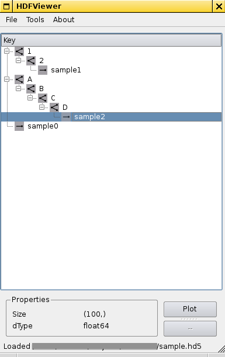

###About

A simple python piece to browse HDF5 files. With _very_ basic plotting. Its primary purpose was to play w/ [QTreeViews](https://srinikom.github.io/pyside-docs/PySide/QtGui/QTreeView.html) and learn a bit about [HDF5](https://hdfgroup.org/HDF5/). If you're looking for a proper Python/HDF5 tool have a look at [PyTables](http://www.pytables.org/).

###Requirements:

  * PySide
  * numpy
  * h5py
  * matplotlib (for plotting)

####Prequesites for h5py:

In order to ```pip-2.7 install h5py``` a number of dependencies had to be satisfied, but weren't solved automatically (on my openSuse 13.1 box). These packages were needed:

  * cython
  * hdf5-devel
  * numpy-devel

```sh
# on openSuse 13.1 this should do the trick
sudo zypper in python-Cython, hdf5-devel, python-numpy-devel
sudo pip-2.7 install h5py
```

###Screenshot:


